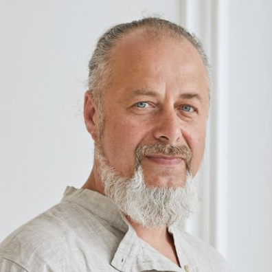

#
Вячеслав Роду

<figure markdown>
{ align=center }
  <figcaption>Парапсихолог, регрессолог, мастер медитаций </figcaption>
</figure>

##
 

 - Мастер Родовых сценариев (расстановок) и Душевного интеллекта.
 - Наставник духовного роста, обретения счастья, богатства и благополучия.
 - Награжден грамотой ООН за вклад по развитию человечества.
 
- Восстановление энергетики, раскрытие экстрасенсорных способностей,
- Обретение счастья, богатства, любви. Увеличение дохода. Налаживание отношений,
- Избавление от боли, избавление от причин заболеваний. Остеопатическое выравнивание тела. Восстановление родовых связей и течения родовых энергий.
- Более 10 супружеских пар избавились от бесплодия.
- Помощь в обретении уникальных возможностей людям помогающих профессий (психологам, остеопатам, массажистам,  адвокатам, финансистам, менеджерам)
 

[Узнать больше об авторском курсе Фитнес Сознания](https://centrkolo.autoweboffice.ru/?r=ordering/cart/as1&id=8&clean=true&lg=ru&Settings[hideColQuantity]=1&Settings[hideColDelete]=1){ .md-button }
